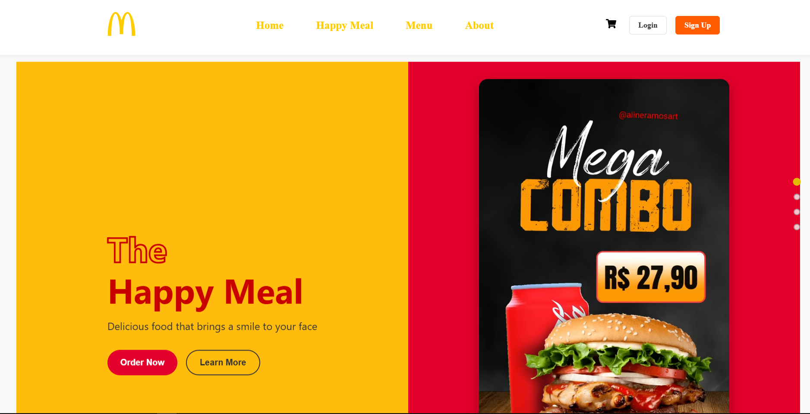
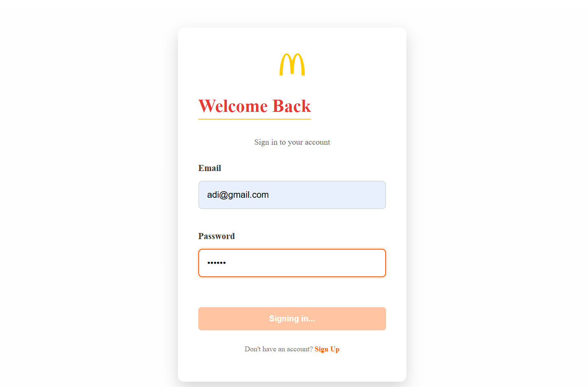
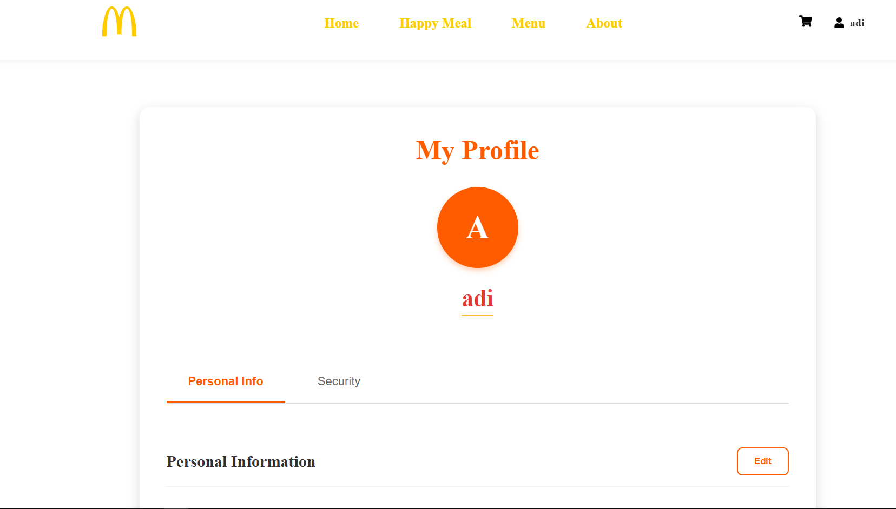
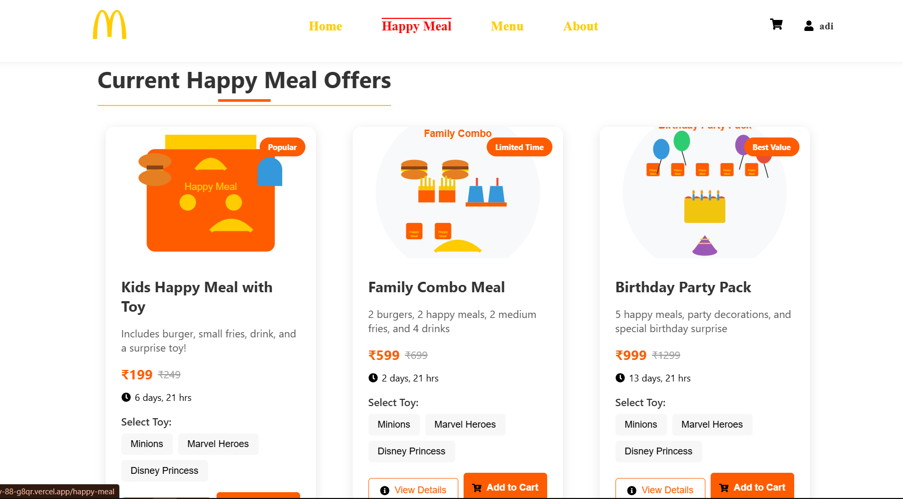
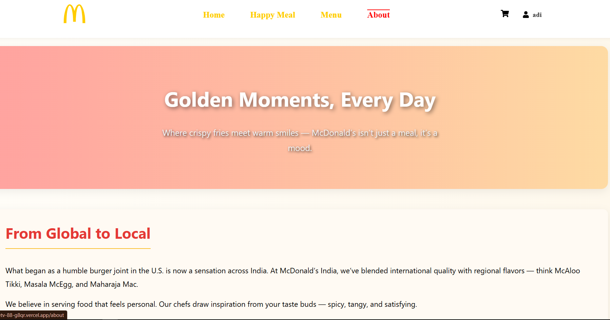
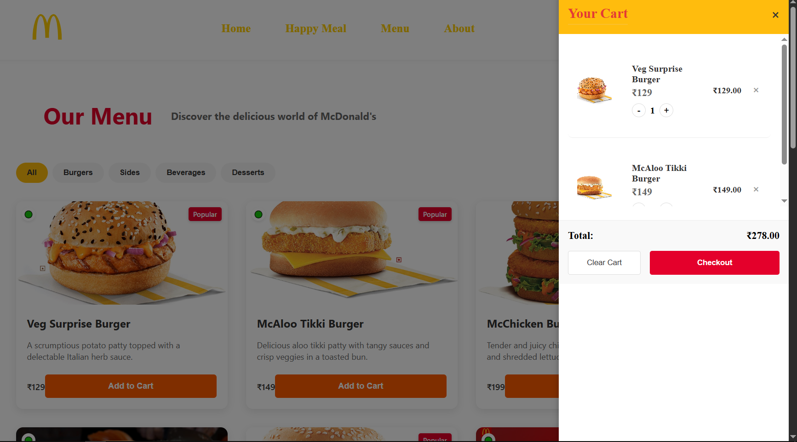
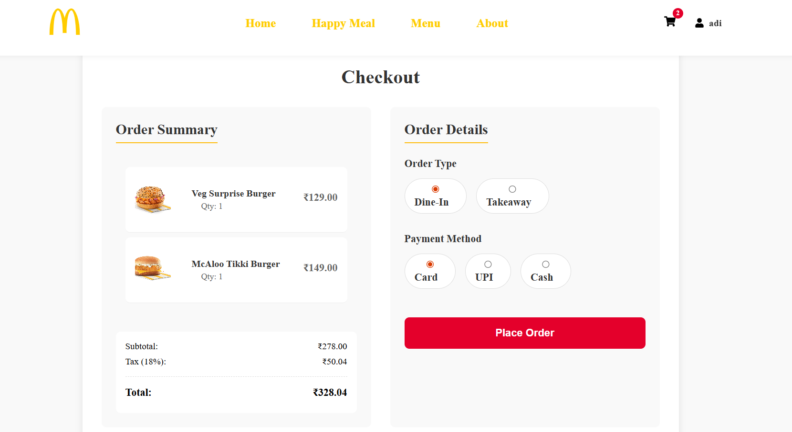

## McDonalds-Website-Clone 

# This project is a MERN stack McDonald’s website clone built to replicate the online food ordering experience. It allows users to browse the menu, add items to the cart, and place orders. The project demonstrates full-stack development using MongoDB, Express, React, and Node.js, with Mongoose as the ODM for database modeling.

Currently, the app supports login/signup, menu browsing, and cart/order placement. A payment gateway integration is planned for future updates.

# 🌍 Purpose & Vision

This project was built to practice end-to-end web development with MERN while replicating real-world food ordering workflows. The vision is to:

Build a fully functional restaurant website with a real-world use case.

Showcase authentication, data modeling, and state management in MERN.

Extend the project to include payment integration and order tracking.

Demonstrate scalability using modern web practices.

⚙️ Tech Stack

Frontend: React + Tailwind CSS (for responsive UI)

Backend: Node.js + Express.js

Database: MongoDB with Mongoose (for schema design & queries)

Authentication: JWT-based login & signup

Future Update: Integration with Razorpay/Stripe for secure online payments

# 🚀 Features

✅ User authentication (Signup/Login)
✅ Menu page with dynamic items (pulled from MongoDB)
✅ Add to Cart functionality
✅ Order placement simulation (stored in database)
✅ Responsive UI (optimized for desktop & mobile)
🟡 (Coming soon) Payment gateway integration (Stripe/Razorpay)
🟡 (Future) Admin dashboard for menu & order management

# 📸 Screenshots

# 🔄 How It Works

User signs up or logs in.

User browses the McDonald’s-style menu (data fetched from MongoDB).

Items can be added/removed from the cart.

User places an order → order stored in database.

(Future) Payment gateway processes the order securely.

User receives confirmation message.

# 🛠️ Getting Started
Clone the repo
git clone https://github.com/yourusername/McDonalds-Website-Clone.git
cd McDonalds-Website-Clone

Backend Setup
cd backend
npm install
npm start

Frontend Setup
cd frontend
npm install
npm start

# Environment Variables

Create a .env file in the backend directory with:

MONGO_URI=your_mongodb_connection_string
JWT_SECRET=your_secret_key
PORT=5000

# 📌 Future Improvements

🔐 Payment integration (Stripe/Razorpay)

📊 Admin panel for menu and orders

📱 Push notifications for order updates

🌐 Deployment on Vercel/Render + MongoDB Atlas
